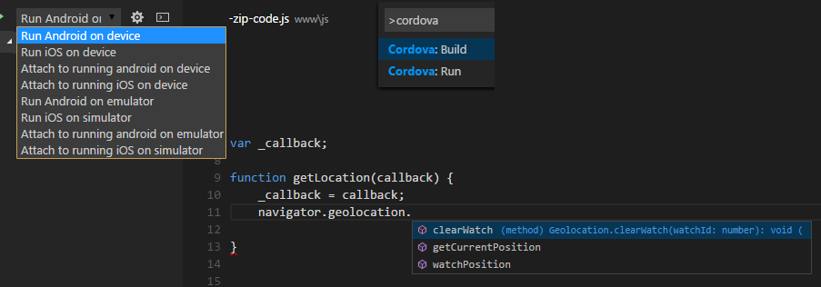
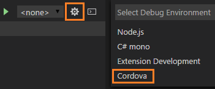
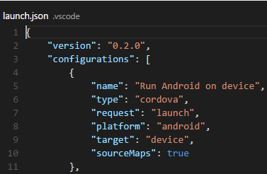
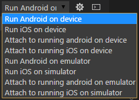
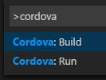
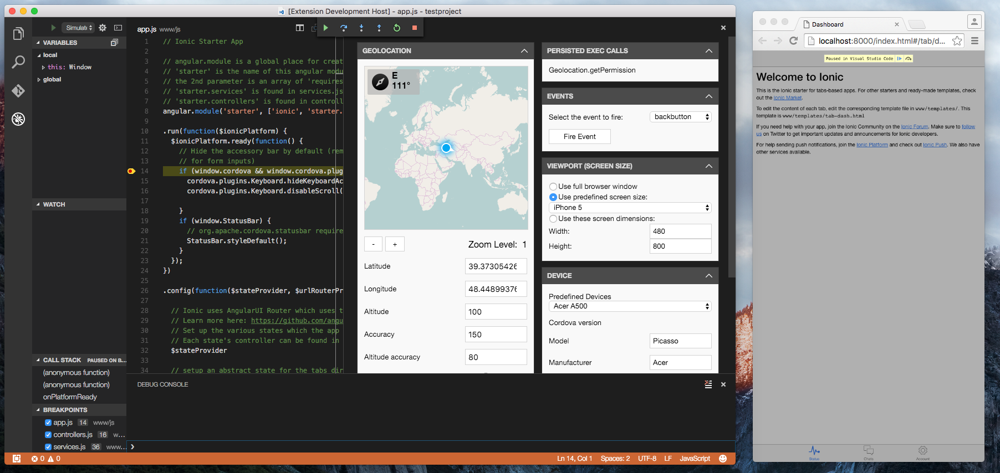
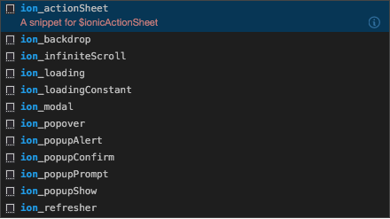
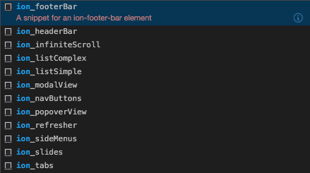
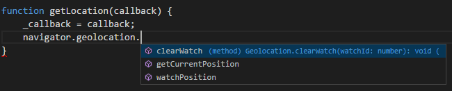
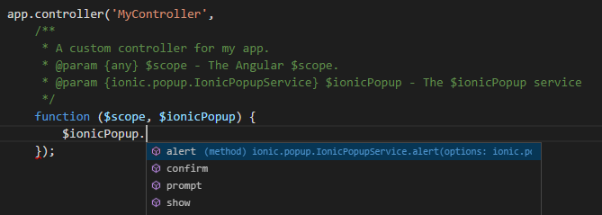

# Cordova Tools Extension
[](https://dev.azure.com/vscode-webdiag-extensions/VS%20Code%20WebDiag%20extensions/_build/latest?definitionId=13)

Debug your code, find commands in the Command Palette, and use IntelliSense to browse objects, functions, and parameters in plugin APIs. This extension works with any Cordova-based project.



## Install it

0. Install [NodeJS](https://nodejs.org)
1. Open a Terminal (on a Mac) or a Command Prompt (on a Windows computer).
2. Run `npm install -g cordova`
3. If you're planning on targeting iOS devices,
 * Set up your machine by following instructions at [iOS Platform Guide from Apache Cordova](https://cordova.apache.org/docs/en/latest/guide/platforms/ios/index.html)
 * Install [HomeBrew](http://brew.sh/) on your Mac.
 * Open a Terminal and run `brew install ideviceinstaller ios-webkit-debug-proxy`
4. If you're planning on targeting Android devices, set up your machine by following instructions at [Android Platform Guide from Apache Cordova](https://cordova.apache.org/docs/en/latest/guide/platforms/android/index.html)

## Add a platform to your Cordova project

Open a Terminal or a Command Prompt and run the following command in the root directory of your project

`cordova platform add android`

Supported platforms: `android, ios`

## Choose the Cordova debug environment

Click the debug icon () in the View bar, and then click the configure gear icon () to choose the Cordova debug environment.



The launch configuration file appears. It contains some default configurations such as what is shown below.



You can modify these configurations or add new ones to the list. Just don't add a Windows or a Browser configuration as they are not supported yet.

You can use other fields in these configurations as well. Here's the complete list:

Name                               | Description                                                                                                                                   | Defaults
---------------------------------- | ----------------------------------------------------------------------------------------------------------------------------------------------| ---------
`port`                             | The port number that the debugger uses to connect to a device or emulator.                                                                    | 9222
`platform`                         | The target platform to run for (either 'ios' or 'android'; other platforms are not currently supported).                                      | n/a
`target`                           | Either 'device', 'emulator', or identifier for a specific device / emulator. For simulation in the browser, you can use 'chrome', 'chromium'. | n/a
`sourceMaps`                       | Set this field to `true` if you want the debugger to use javascript sourcemaps (if they exist).                                               | false
`webkitRangeMin`, `webkitRangeMax` | Combines to specify the port range that you want the debugger to use to find the specific device or simulator described in the configuration. | 9223, 9322
`attachAttempts`                   | The maximum number of times that you want the debugger to attempt to attach to a running iOS app.                                             | 5
`attachDelay`                      | The time in milliseconds between each attempt to attach to a running iOS application.                                                         | 1000
`iosDebugProxyPort`                | The port number that you want the debugger to use when it launches iOS applications on a device.                                              | 9221
`appStepLaunchTimeout`             | The maximum time in milliseconds allowed for each individual step the debugger takes to launch an iOS app on a device.                        | 5000
`ionicLiveReload`                  | Set to true to enable Ionic live reload.                                                                                                      | false
`devServerAddress`                 | For Ionic live reload scenario specify the IP address the device can use to contact the Ionic server.                                         | n/a
`devServerPort`                    | For Ionic live reload scenario specify the port the device can use to contact the Ionic server.                                               | n/a
`devServerTimeout`                 | Timeout in milliseconds for starting the Ionic dev server when serving to the browser or running with Ionic live reload enabled.              | 20000
`simulatePort`                     | Port to use for connecting to the local Cordova Simulate server.                                                                              | 8000
`livereload`                       | When simulating in the browser, determines whether live reload is enabled.                                                                    | true
`forceprepare`                     | When simulating in the browser, determines whether a file change triggers a cordova prepare before live reloading.                            | false
`simulateTempDir`                  | The directory where temporary browser simulation files are hosted.                                                                            | `${workspaceRoot}`/.vscode/simulation
`runArguments`                     | Run arguments (array) to be passed to 'cordova run/build <platform>' or 'ionic serve' command (Override all other configuration params).      | n/a


## Debug your Cordova-based project

To start the debugger, choose a target from the target drop-down list, and then either click the start button () or press F5.



You can debug your app on an Android emulator, iOS simulator, or a device. If you have your app running in one already, you can attach the debugger to it. The debugger uses the application ID of your project to locate the running instance.

> **Visual Studio Emulator for Android:**
To deploy your app to the Visual Studio Emulator for Android using our extension, you first need to manually launch the emulator. Once it is running, select the ```Run Android on Device``` debug target rather than the emulator target. If *ADB* didn't automatically recognize the VS Android emulator when you launched it, you will need to run ```adb connect [EMULATOR'S IP]``` on the command prompt before trying to deploy. To find out the IP address of your emulator, click the double arrow icon at the bottom of the emulator's side-menu to open the "Additional Tools" window, and go to the "Network" tab. Use the IP of an appropriate network adapter in the list.

We won't go into all of the great things that you can do with the Visual Studio Code debugger, but you can read about it [here](https://code.visualstudio.com/docs/editor/debugging).

> **Troubleshooting tip:**
If you receive an error stating that ADB is not recognized as an internal or external command, you'll have to update your path variable to include the location of your *ADB* executable file. The *ADB* executable file is located in a subfolder along with your other Android SDK files. For example, on a Windows computer, the location of the *ADB* executable file would likely be here: ```C:\Program Files (x86)\Android\android-sdk\platform-tools```.

## Find Cordova commands in the Command Palette

In the Command Palette, type ```Cordova``` and choose a command.



The **Build** command triggers ```cordova build``` and builds for all platforms that you've added to the project.

Since all platforms are built you may receive errors for incompatible configurations.
For example, if you're on a Windows computer, and you've added an iOS platform to your project, you'll get an error because you need a Mac to build for iOS platforms. You can't build an iOS app on a Mac by using VSCode on a Windows computer.

The **Prepare** command triggers `cordova prepare`, which transforms `config.xml` metadata to platform-specific manifest files, copies icons & splashscreens, copies plugin files for specified platforms so that the project is ready to build with each native SDK.

The **Run** command triggers `cordova run` and starts your app without debugging and just like the **Build** command, it runs *all* platforms that you've added to your project.

The **Simulate Android in browser** and **Simulate iOS in browser** launch your application in the browser and they are described in the next section.

## Simulate your app in the browser

The debugging target list includes two additional targets: `Simulate Android in browser` and `Simulate iOS in browser`. If you don't see these targets in your debugging target list, you might have to remove your `.vscode/launch.json` configuration file and regenerate it
by following the steps described in the [Choose the Cordova debug environment](#choose-the-cordova-debug-environment) section.

If you just want to run the application in the browser without debugging, two commands with the same names are available in the Command Palette.

If you launch the application using one of these debug targets or commands, the application will launch in Chrome, and Visual Studio Code will display an additional panel that
controls the simulation for the core plugins added to your project. Here are some of the new features:

* support for the majority of core plugins
* live reload
* event firing
* device screen resizing (while debugging only)



>**Note**: If the simulate panel is closed accidentally when you navigate to a new file in your editor, it can be reopened by using `Ctrl+Tab`. This is the same command you use for navigating through your open documents.

Here is a [video demo](https://www.youtube.com/watch?v=LdFT6xxhSbw) of the feature. If you have feature requests or suggestions, please reach out to us [here](https://github.com/Microsoft/vscode-cordova/issues/new).

## Support for Ionic

* The debug target includes the ability to serve to the browser for use with Ionic projects. You can now deploy and debug directly to Chrome, live reload is enabled by default.

* We've included a number of useful JavaScript and HTML code snippets for your project, try typing `ion_` in the editor to see what's available.




* New Ionic commands have also been added to the Command Palette, type `Ionic` in the palette to see the full list.

* Ionic live reload is supported on devices and emulators.

* Additional IntelliSense has been added for Ionic, Angular and JQuery.

## Use IntelliSense with Plugin APIs

Intellisense helps you discover objects, functions, and parameters in libraries that your project consumes. Now you can use it for the more popularly used *core* plugins.



IntelliSense appears only for plugins that you've added to your project, but it doesn't matter whether you add the plugin before or after you install this extension.

Just start typing in the code editor to see the objects, functions, and parameters of your plugin's API.

By default, this extension supports the typings for the following plugins. To add typings for other plugins, place the appropriate `.d.ts` file(s) in your project's `.vscode/typings` folder.
* cordova-plugin-battery-status
* cordova-plugin-camera
* cordova-plugin-contacts
* cordova-plugin-device
* cordova-plugin-device-motion
* cordova-plugin-device-orientation
* cordova-plugin-dialogs
* cordova-plugin-file
* cordova-plugin-file-transfer
* cordova-plugin-globalization
* cordova-plugin-inappbrowser
* cordova-plugin-media
* cordova-plugin-media-capture
* cordova-plugin-network-information
* cordova-plugin-splashscreen
* cordova-plugin-statusbar
* cordova-plugin-vibration
* cordova-plugin-websql
* cordova-plugin-x-toast
* ionic-plugin-keyboard
* phonegap-plugin-barcodescanner
* phonegap-plugin-push

## Use IntelliSense with injected Ionic and Angular services

While IntelliSense is also available for Ionic and Angular, these frameworks use a dependency injection model for built-in services that VSCode's language service cannot understand by default.

To properly enable IntelliSense in these scenarios, you will need to use [JSDoc headers](http://usejsdoc.org/about-getting-started.html).



Our extension will provide the typings for you, so all you have to do is create the JSDoc headers above the functions you wish to receive IntelliSense for.

> **Note:**
JSDoc headers may not be supported (for IntelliSense purposes) in old VSCode versions.

For Ionic services, the service type will be in the following format: ```ionic.[service].Ionic[Service]Service```, where ```[service]``` and ```[Service]``` should be replaced with the service's name, without the ```$ionic``` prefix. For example:

```@param {ionic.popup.IonicPopupService} $ionicPopup - The $ionicPopup service```

```@param {ionic.modal.IonicModalService} $ionicModal - The $ionicModal service```

For Angular services, the service type will be in the following format: ```angular.I[Service]Service```, where ```[Service]``` should be replaced with the capitalized service's name, without the ```$``` prefix. For example:

```@param {angular.ITimeoutService} $timeout - The Angular $timeout service```

```@param {angular.IHttpService} $http - The Angular $http service```

For a list of supported services for IntelliSense, see the ```angular.d.ts``` and ```ionic.d.ts``` typing files, which our extension places by default under ```.vscode/typings``` in your project.

## How to disable telemetry reporting

VS Code Cordova extension collects usage data and sends it to Microsoft to help improve our products and services. Read our [privacy statement](https://www.visualstudio.com/en-us/dn948229) to learn more.

If you don’t wish to send usage data to Microsoft, please follow the instructions below to disable its collection.

### Windows

* Edit VSCodeTelemetrySettings.json file at `%appdata%\vscode-cordova` and add "optIn":false.

### OS X / Linux

* Edit VSCodeTelemetrySettings.json file at `~/.vscode-cordova` and add "optIn":false.

## Known Issues

* Error `Unable to find webview` while debugging on iOS Simulator

This is [ios-webkit-debug-proxy issue](https://github.com/google/ios-webkit-debug-proxy/issues/250). Apple removed option to enable WebInspector inside simulator and debug proxy unable to connect to application webview.

*  Error `Error: Project does not include the specified platform: android` while running `Simulate android in browser` on Ubuntu machine.

This is cordova-serve issue, please, see details [here](https://github.com/Microsoft/vscode-cordova/issues/438).

* Error `Error running android` while running Ionic 4 project for android platform

It caused by [ionic cli bug](https://github.com/ionic-team/ionic-cli/issues/3376). As workaround, you can use Node JS v10+.

* After running Ionic 4 project on native platform I get white screen in application and error `(intermediate value).fill is not a function` in Debug Console.

This is [ionic bug](https://github.com/ionic-team/ionic-cli/issues/3709).

* A complete [list of known issues](https://github.com/Microsoft/vscode-cordova/issues?q=is%3Aissue+label%3Aknown-issue+) can be found on [GitHub](https://github.com/Microsoft/vscode-cordova)